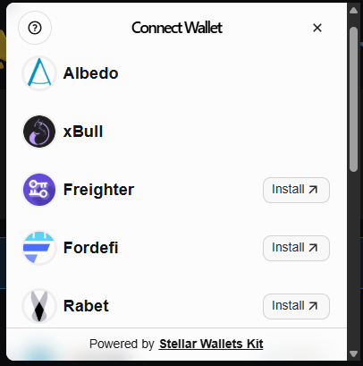
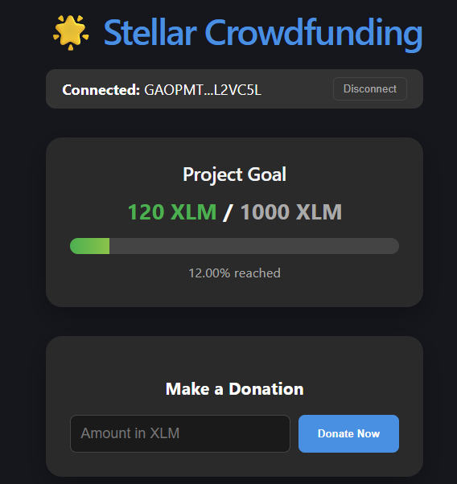
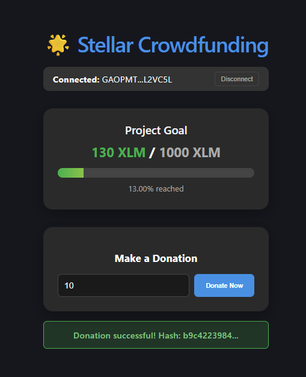

# Stellar Yellow Belt: Crowdfunding dApp

A real-time crowdfunding application built on Stellar using Soroban smart contracts.

## 🚀 Features
- **Multi-Wallet Support**: Integration using `stellar-wallets-kit` for various Stellar wallets.
- **Soroban Smart Contract**: Deployed on testnet to manage goals and donations.
- **Real-time Progress**: Dynamic progress bar reflecting current funds vs goal.
- **Transaction Tracking**: Pending, success, and failure states for donations.
- **Error Handling**: Graceful handling of connection failures and invalid inputs.

## 🛠 Tech Stack
- **Frontend**: React, TypeScript, Vite
- **Smart Contract**: Rust, Soroban SDK
- **Network**: Stellar Testnet
- **Wallets**: Freighter, etc. (via Stellar Wallets Kit)

## 📦 Setup Instructions

### Contract
1. Navigate to `contract/`
2. Build: `stellar contract build`
3. Deploy: `stellar contract deploy --source-account <your-account> --network testnet`

### Frontend
1. Navigate to `frontend/`
2. Install: `npm install`
3. Run: `npm run dev`

## 📄 Submission Details
- **Contract Address**: `CAWS7IF54J7ZFJ4ACANVYNVCFZKPDWWTYDOLML2FJGHBSJBMDRN36K65`
- **Network**: Testnet
- **Live Demo**: [https://crowdfunding-donations.vercel.app](https://crowdfunding-donations.vercel.app)
- **Example Transaction Hash**: `3a607a8b1300c1f41ec0819c40df519fe4f21d21f948e33af610ed611bf888ec`

## 📸 Screenshots

